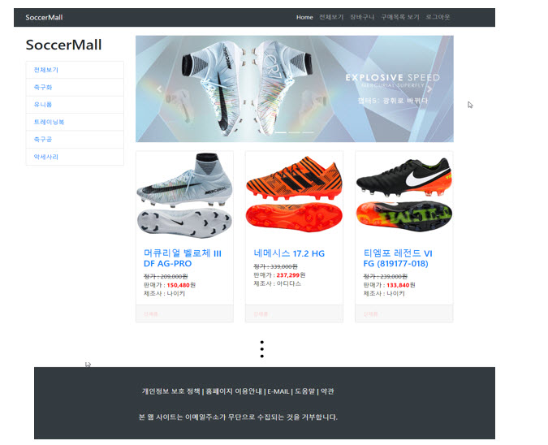
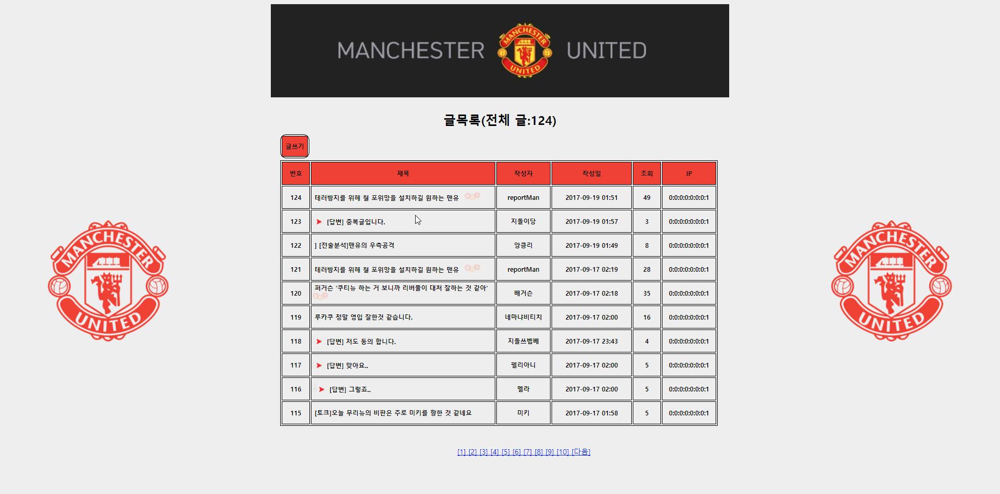
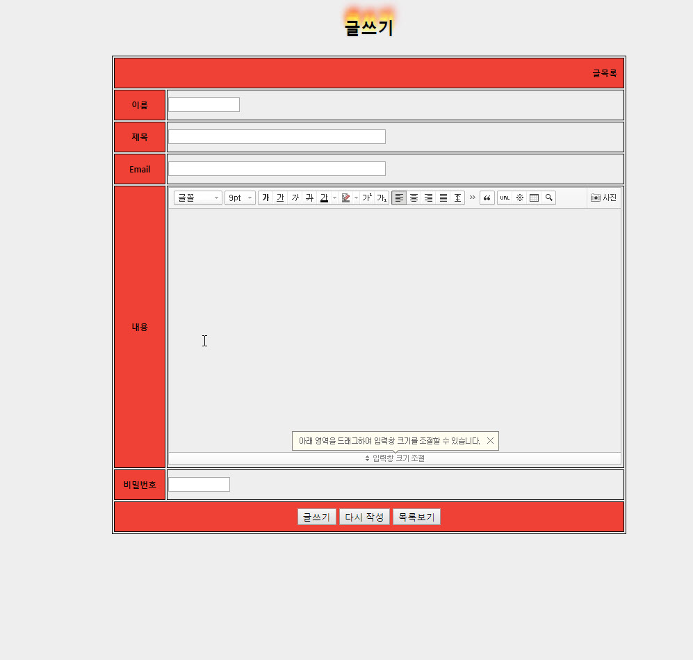

<h1>Model1 패턴의 축구쇼핑몰 프로젝트</h1>
<ul>
  <li><h3>작업기간 : (15일) </h3></li>
  <li><h3>작업인원 : 단독작업</h3></li>
  <li><h3>작업 툴 : Eclipse, Apache Tomcat, Oracle, sqldeveloper, GitHub</h3></li>
  <li><h3>부트 스트랩 : <a href="https://startbootstrap.com/template-categories/all/">Startbootstrap</a>사용</h3></li>
  <li><h3>작품소개 : Apache Tomcat을 사용하여 ConnectionPool을 통해 Oracle(DB)에 연동한 Model1 방식의 축구용품 쇼핑몰 사이트 프로젝트</h3></li>
</ul>

축구용품 쇼핑몰

게시판

스마트에디터2 사용
